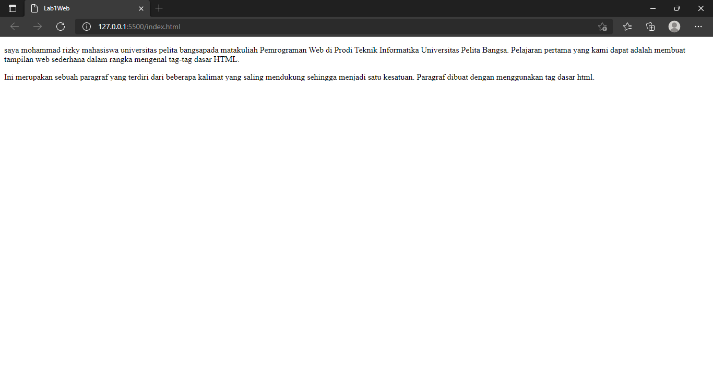
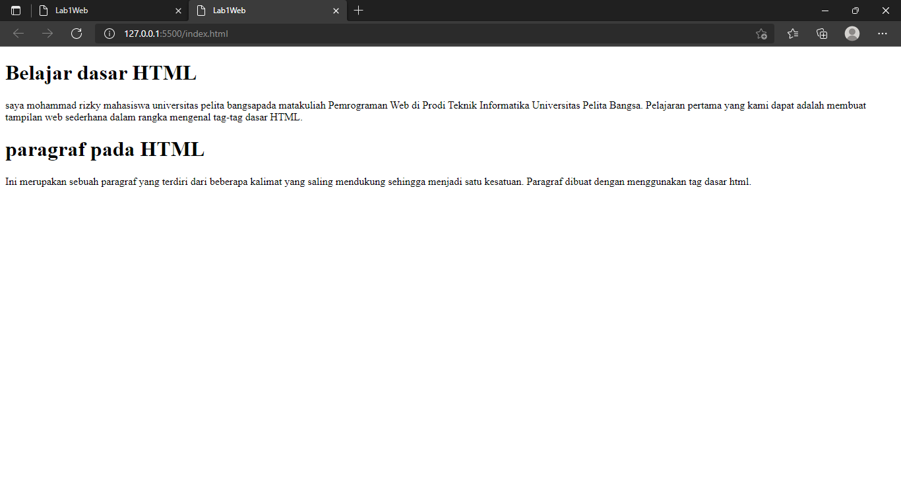

# Lab1web
Nama    : Mohammad Rizky
NIM     : 312010230
Kelas   : TI.20.A2
Matkul  : Pemograman web
## Paragraf

ini adalah contoh dari tag paragraf (p) di dalam tag ini anda bisa menambahkan kalimat sesuai yang anda inginkan
## Heading

ini adalah contoh dari tag heading, heading sendiri merupakan sebagai judul artikel (h1) sendiri merupakan heading terbesar dan (h6) adalah heading terkecil
## Menambahkan Gambar

ini adalah contoh dari tag img untuk menambahkan gambar
## Menambahkan Link

ini adalah contoh dari tag link
